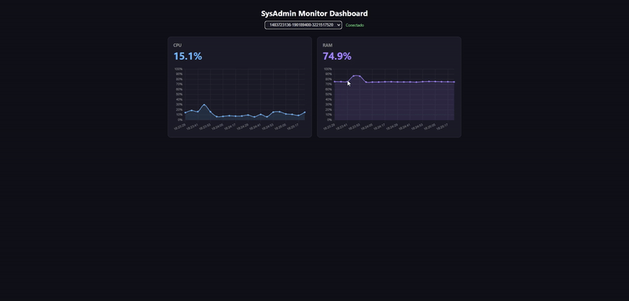

# SysAdmin Monitor Dashboard



Sistema de monitorizacion en tiempo real que recoge metricas de CPU y RAM de varias maquinas y las envia a una API REST

## Como funciona

Un script en Python lee el estado del sistema (CPU y RAM) cada 5 segundos usando `psutil` y lo envia por POST a un backend en Java Spring Boot que lo guarda en base de datos. Un frontend con `Chart.js` muestra los graficos en tiempo real. Soporta multiples maquinas con un selector en el dashboard

## Stack

- **Backend:** Java 21 + Spring Boot + Spring Data JPA
- **Base de datos:** PostgreSQL 16
- **Agente:** Python 3 + `psutil` + `requests`
- **Frontend:** HTML5 + CSS3 + JavaScript + `Chart.js`
- **Testing:** JUnit 5 + Mockito + MockMvc
- **CI:** GitHub Actions
- **Infraestructura:** Docker + Docker Compose

## Como arrancarlo

### Opcion A - Todo con Docker (un solo comando)
```bash
    docker compose up --build
```
Abre `http://localhost:8080/index.html` y el dashboard estara funcionando

Para parar:
```bash
    docker compose down
```
### Opcion B - Desarrollo local (H2 en memoria)

Abrir el proyecto `backend/` en IntelliJ y ejecutar `MonitorApplication.java`

Arrancar el agente:
```bash
    cd agent
    pip install -r requirements.txt
    python agent.py
```
### Opcion C - Backend local + PostgreSQL en Docker

Levantar solo la base de datos:
```bash
    docker compose up postgres -d
```
Arrancar el backend con perfil de produccion:
```bash
    cd backend
    .\mvnw spring-boot:run "-Dspring-boot.run.profiles=prod"
```
### Dashboard

Abrir `http://localhost:8080/index.html` en el navegador. Usar el selector de arriba para filtrar por maquina

### Ejecutar tests
```bash
    cd backend
    .\mvnw test
```
## API

### POST `/api/metrics`

Envia una metrica. Todos los campos son obligatorios. `cpuUsage` y `ramUsage` deben estar entre 0 y 100

    {"hostname": "PC-01", "cpuUsage": 45.2, "ramUsage": 67.8}

### GET `/api/metrics`

Devuelve las ultimas 20 metricas. Se puede filtrar por maquina con `?hostname=PC-01`

### GET `/api/metrics/hosts`

Devuelve la lista de maquinas que han enviado datos

## Estado del proyecto

- [x] API REST con endpoints POST y GET
- [x] Agente Python que envia metricas automaticamente
- [x] Soporte multi-maquina con selector en el dashboard
- [x] PostgreSQL con Docker para produccion
- [x] H2 en memoria para desarrollo
- [x] Frontend con graficos de CPU y RAM en tiempo real
- [x] Perfiles de Spring (dev/prod/docker)
- [x] Validacion de datos con Bean Validation
- [x] Manejo global de errores
- [x] Tests unitarios y de integracion
- [x] CI con GitHub Actions
- [x] Proyecto completamente dockerizado